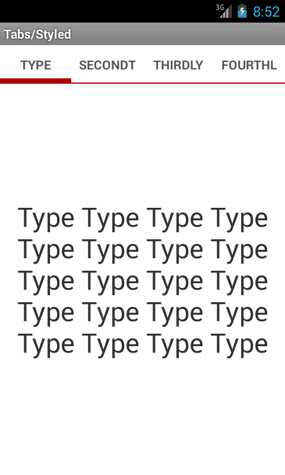
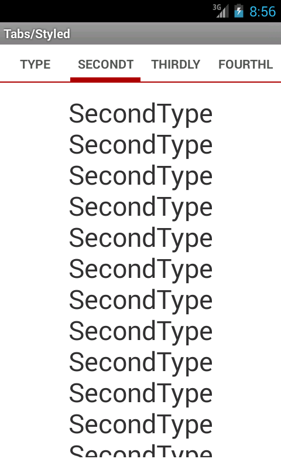

# vpitabscrollissue

Found an issue in (at least) API's between 15 and 20 (exclusive) where the tabs are displayed as fixed when they should be scrollable.

The behaviour can be elicited in devices of any screen size/density by playing around with paddings and text sizes. The committed code causes the issue on an emulator with the following specs

* Screen size: 4inch
* Resolution: 480x800
* API: 18 (4.3.1)

